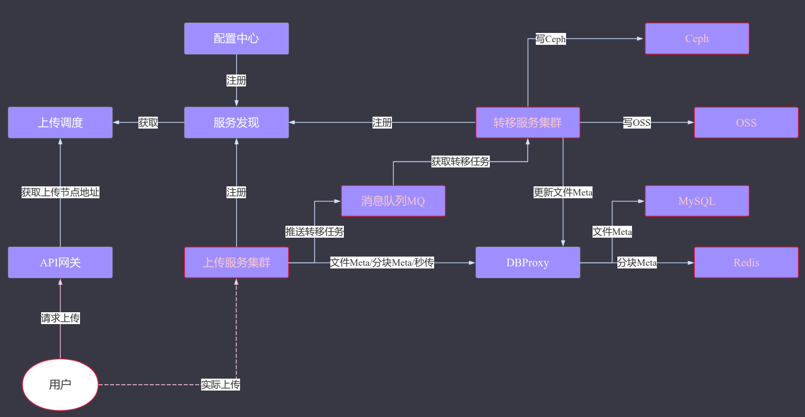
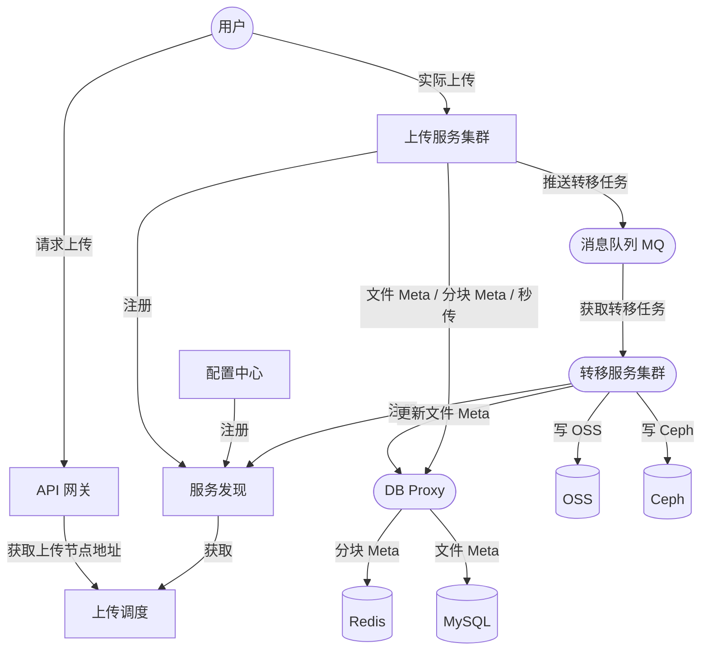
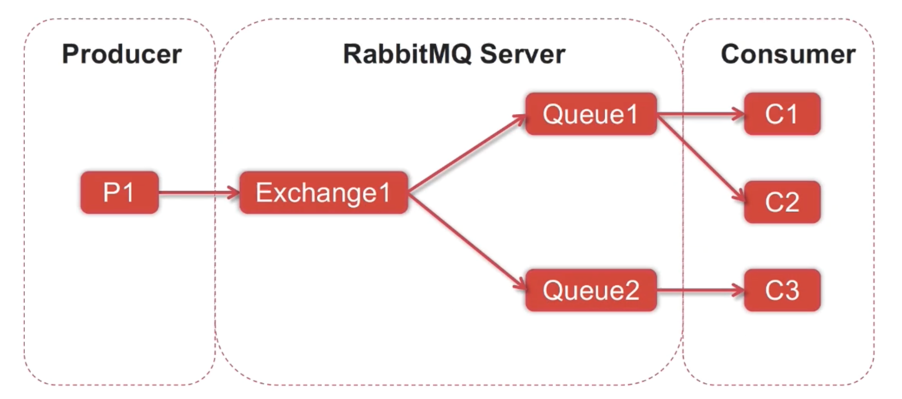
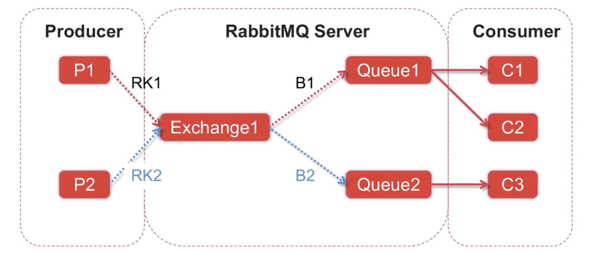
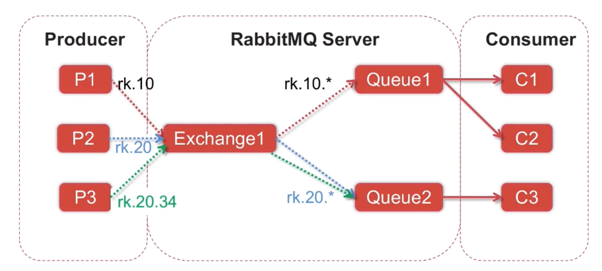
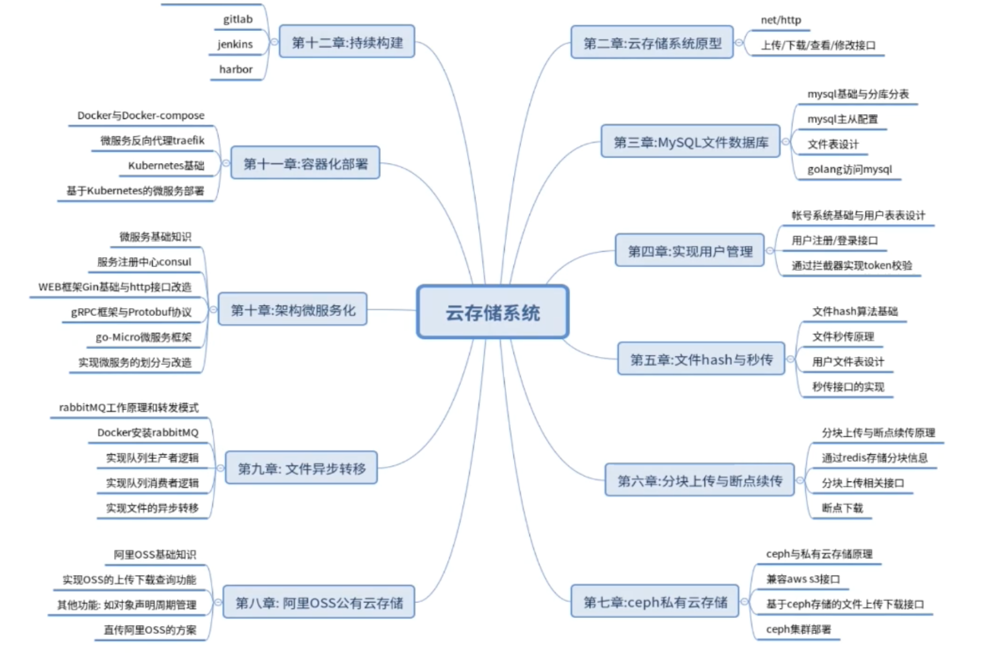
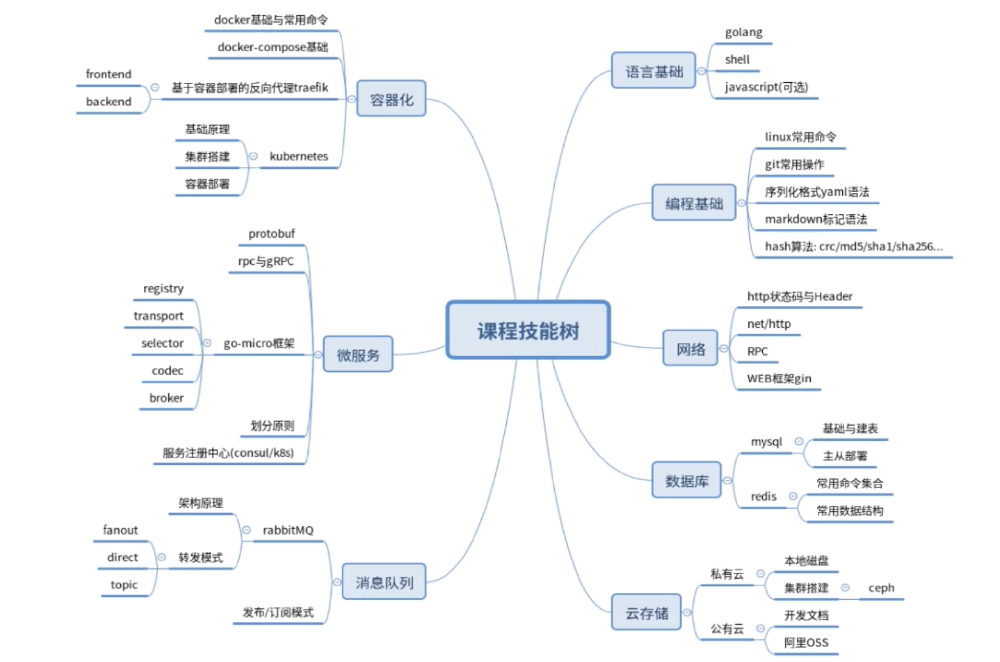

# pan.go


<div align="center">
  
</div>


## 1. 使用

### 1.1. 安装外部库


```bash
go get github.com/garyburd/redigo/redis
go get github.com/go-sql-driver/mysql
go get github.com/garyburd/redigo/redis
go get github.com/json-iterator/go
go get github.com/aliyun/aliyun-oss-go-sdk/oss
go get gopkg.in/amz.v1/aws
go get gopkg.in/amz.v1/s3
go get github.com/streadway/amqp
```

### 1.2. 启动服务

#### 1.2.1. 在加入 RabbitMQ 实现文件异步转移之前

启动上传应用程序:

```bash
$ cd $GOPATH/pan.go
$ go run main.go
```

#### 1.2.2. 在加入 RabbitMQ 实现文件异步转移阶段, 启动方式 (分裂成了两个独立程序):

启动**上传**应用程序:

```bash
$ cd $GOPATH/pan.go
$ go run service/upload/main.go
```

启动**转移**应用程序:

```bash
$ cd $GOPATH/pan.go
$ go run service/transfer/main.go
```

打开 `localhost:8080` 端口查看

```
http://localhost:8080
```


## 2. 项目支持的功能

* [x] 简单的文件上传服务
* [x] MySQL 存储文件元数据
* [x] 账号系统, 注册/登录/查询用户或文件数据
* [x] 基于帐号的文件操作接口
* [x] 文件秒传功能
* [x] 文件分块上传/断点续传功能
* [x] 搭建及使用 Ceph 对象存储集群
* [x] 使用阿里云 OSS 对象存储服务
* [x] 使用 RabbitMQ 实现异步任务队列
* [ ] 微服务化 (API网关, 服务注册, RPC通讯)
* [ ] CI/CD (持续集成)


## 3. 详细介绍

### 3.1. 项目架构组成


<div align="center">
  
</div>


mermaid 流程图代码:



### 3.2. 基于 MySQL 的文件数据库

MySQL 主要用作两个数据库

- 用户表
- 文件表

备用字段的目的是:

1. 安全性. 避免在物理层面删除数据所造成的数据丢失
2. 减少文件删除所生成的文件碎片

```sql
CREATE TABLE `tbl_file` (
  `id` int(11) NOT NULL AUTO_INCREMENT,
  `file_sha1` char(40) NOT NULL DEFAULT '' COMMENT '文件hash',
  `file_name` varchar(256) NOT NULL DEFAULT '' COMMENT '文件名',
  `file_size` bigint(20) DEFAULT '0' COMMENT '文件大小',
  `file_addr` varchar(1024) NOT NULL DEFAULT '' COMMENT '文件存储位置',
  `create_at` datetime default NOW() COMMENT '创建日期',
  `update_at` datetime default NOW() on update current_timestamp() COMMENT '更新日期',
  `status` int(11) NOT NULL DEFAULT '0' COMMENT '状态(可用/禁用/已删除等状态)',
  `ext1` int(11) DEFAULT '0' COMMENT '备用字段1',
  `ext2` text COMMENT '备用字段2',
  PRIMARY KEY (`id`),
  UNIQUE KEY `idx_file_hash` (`file_sha1`),
  KEY `idx_status` (`status`)
) ENGINE=InnoDB DEFAULT CHARSET=utf8;
```

当文件存储数量开始变多后, 我们需要考虑**分库分表**


- 通过 `sql.DB` 来管理连接数据库对象
- 通过 `sql.Open` 来创建**协程**安全的 `sql.DB` 对象
- 优先使用 Prepared Statement
    - 有效防止 SQL 注入攻击
    - 实现自定义参数查询, 提高效率


### 3.3. 用户系统 - 资源隔离及鉴权

创建用户表结构

```sql
CREATE TABLE `tbl_user` (
  `id` int(11) NOT NULL AUTO_INCREMENT,
  `user_name` varchar(64) NOT NULL DEFAULT '' COMMENT '用户名',
  `user_pwd` varchar(256) NOT NULL DEFAULT '' COMMENT '用户encoded密码',
  `email` varchar(64) DEFAULT '' COMMENT '邮箱',
  `phone` varchar(128) DEFAULT '' COMMENT '手机号',
  `email_validated` tinyint(1) DEFAULT 0 COMMENT '邮箱是否已验证',
  `phone_validated` tinyint(1) DEFAULT 0 COMMENT '手机号是否已验证',
  `signup_at` datetime DEFAULT CURRENT_TIMESTAMP COMMENT '注册日期',
  `last_active` datetime DEFAULT CURRENT_TIMESTAMP ON UPDATE CURRENT_TIMESTAMP COMMENT '最后活跃时间戳',
  `profile` text COMMENT '用户属性',
  `status` int(11) NOT NULL DEFAULT '0' COMMENT '账户状态(启用/禁用/锁定/标记删除等)',
  PRIMARY KEY (`id`),
  UNIQUE KEY `idx_username` (`user_name`),
  KEY `idx_status` (`status`)
) ENGINE=InnoDB AUTO_INCREMENT=5 DEFAULT CHARSET=utf8mb4;
```

用户登陆之后, 会自动生成 token 方便下次登录, 所以我们创建一个新的表, 用来存储生成的 token

```sql
CREATE TABLE `tbl_user_token` (
  `id` int(11) NOT NULL AUTO_INCREMENT,
  `user_name` varchar(64) NOT NULL DEFAULT '' COMMENT '用户名',
  `user_token` char(40) NOT NULL DEFAULT '' COMMENT '用户登录token',
  PRIMARY KEY (`id`),
  UNIQUE KEY `idx_username` (`user_name`)
) ENGINE=InnoDB DEFAULT CHARSET=utf8mb4;
```

**用户系统的一些接口的实现逻辑:**

_用户注册功能_

1. `HTTP GET` 请求, 返回登录页面的内容
2. 校验参数的有效性
3. 加密用户名和密码
4. 存入数据库并且返回结果

_用户登录_

1. 校验用户名和密码
2. 生成访问凭证
3. 存储 token 到数据库

_用户查询_

1. 解析请求参数
2. 验证 token 是否过期/有效
3. 查询用户信息
4. 响应用户数据


### 3.4. 基于 Hash 算法实现文件秒传

秒传原理以及应用

1. 用户上传 - 体积很大的文件也可以瞬间完成, 其他用户也上传过相同文件 (文件校验算法相同结果)
2. 离线下载
3. 好友分享

所以根据以上, 为了实现秒传

- 文件 Hash (MD5, SHA1 等)
- 用户/文件关联


<div align="center">
  
</div>


我们定义一个 "用户-文件表" 来存储上传的文件所属信息

```sql
CREATE TABLE `tbl_user_file` (
  `id` int(11) NOT NULL PRIMARY KEY AUTO_INCREMENT,
  `user_name` varchar(64) NOT NULL,
  `file_sha1` varchar(64) NOT NULL DEFAULT '' COMMENT '文件hash',
  `file_size` bigint(20) DEFAULT '0' COMMENT '文件大小',
  `file_name` varchar(256) NOT NULL DEFAULT '' COMMENT '文件名',
  `upload_at` datetime DEFAULT CURRENT_TIMESTAMP COMMENT '上传时间',
  `last_update` datetime DEFAULT CURRENT_TIMESTAMP ON UPDATE CURRENT_TIMESTAMP COMMENT '最后修改时间',
  `status` int(11) NOT NULL DEFAULT '0' COMMENT '文件状态(0正常1已删除2禁用)',
  UNIQUE KEY `idx_user_file` (`user_name`, `file_sha1`),
  KEY `idx_status` (`status`),
  KEY `idx_user_id` (`user_name`)
) ENGINE=InnoDB DEFAULT CHARSET=utf8mb4;
```


那么我们怎么实现秒传判断的接口呢?

1. 首先解析传入的参数
2. 然后在文件表中查询是否存在相同的文件 Hash 值
3. 如果不存在, 那么秒传失败
4. 如果查询成功, 那么写入用户-文件表, 更新信息, 并且返回 "秒传成功"


针对相同的文件(文件加密后 sha1 值相同)

- 允许不同用户上传同一个文件
- 先完成上传的先被存入数据库
- 后上传的只会更新"用户-文件表", 完成后会删除文件


### 3.5. 基于 Redis 实现分块上传及断点续传

**分块上传**

文件切分成多块, 独立传输, 上传后合并文件

**断点续传**

传输暂停或者出现异常中断后, 可以基于原来的进度继续

**说明**

1. 小文件不需要进行分块上传, 因为分块上传接口更复杂
2. 可以并行分块上传, 并且可以无序传输
3. 提高传输速率
4. 减少失败后重试的时间和流量


### 3.6. 基于 Ceph 搭建私有云存储服务

Ceph 基础组件

1. OSD: 用于集群中所有数据与对象的存储, 存储/复制/平衡/恢复数据等等
2. Monitor: 监控集群状态, 维护 Cluster MAP 表, 保证集群数据一致性
3. MDS: 保存文件系统服务的元数据 (OBJ/Block 不需要该服务)
4. GW: 提供与 Amazon S3 和 Swift 兼容的 RESTful API 的 GateWay 服务


### 3.7. 阿里云OSS实现海量数据上云

略


### 3.8. 基于 RabbitMQ 实现异步存储


#### 异步逻辑的实现

<div align="center">
  
</div>


mermaid 流程图代码

```
graph LR
  B[客户端] --> A[上传服务]
  A[上传服务] --> B[客户端]
  A[上传服务] --> C[临时存储] & D[任务队列] -.-> E[转移服务]
  E[转移服务] -.-> F[OSS]
  F[OSS] -.-> E[转移服务]
```


#### Rabbit MQ 可以解决什么

1. 逻辑解耦, 异步任务
2. 支持消息持久化, 重启服务不会受到影响
3. 削峰, 大规模消息处理

#### Exchange 工作模式

- Fanout: 类似**广播**, 转发到所有绑定交换机的 Queue
- Direct: 类似**单播**, RoutingKey 和 BindingKey 完全匹配
- Topic: 类似**组播**, 转发到符合通配符匹配的 Queue
- Headers: 请求头与消息头匹配, 才能接受消息


|  	|  	|
|-----------------------	|-----------------------	|
| 工作模式 - Fanout     	| 工作模式 - Direct     	|
|   	|                       	|
| 工作模式 - Topic      	|                       	|


### 3.9. 架构微服务化

#### 3.9.1. 微服务的概念以及原理

微服务的优点:

1. 化繁为简, 分散治理
2. 服务间松耦合, 服务内高内聚
3. 服务科独立构建/部署/升级, 局部更新
4. 提高系统容错性, 减少系统整体崩溃概率
5. 易于实现异构系统

微服务的缺点:

1. 增加了运维部署的工作量与难度
2. 增加了系统间调用逻辑的处理难度
3. 日志更难收集和统计了
4. 额外引入了一些非业务模块服务


### 3.10. Docker & K8s 容器化实战

#### 3.10.1. Docker

Docker 可以做到:

1. 限制容器 CPU 以及内存的资源消耗
2. 依赖环境隔离
3. 快速扩容, 动态起停容器实例


在这里喔们要用到 Docker 的一个工具 `Compose`, 使用 `docker-compose.yml` 进行编写. 是一个进行容器编排的工具

主要步骤拆解:

1. 通过 `Dockerfile` 定义容器环境, 打包成镜像
2. 通过 `docker-compose.yml` 定义各个应用服务

```bash
$ sudo docker-compose up --scale upload=2 --scale download=2 -d
```

#### 3.10.2. Kubernetes

K8s 是一个分布式系统支撑平台

1. 底层可以基于 Docker 来包装应用
2. 以集群的方式来运行/管理跨机器的容器应用
3. 解决了 Docker 跨机器场景的容器通讯问题
4. 拥有自动修复能力

提供部署运行/资源调度/服务发现/动态伸缩等一系列功能


### 4. 总结





## 参考资料

- Go入门: [语言之旅](https://tour.go-zh.org/welcome/1)
- MySQL: [偶然翻到的一位大牛翻译的使用手册](https://chhy2009.github.io/document/mysql-reference-manual.pdf)
- Redis: [命令手册](http://redisdoc.com/)
- Ceph: [中文社区](http://ceph.org.cn/) [中文文档](http://docs.ceph.org.cn/)
- RabbitMQ: [英文官方](http://www.rabbitmq.com/getstarted.html) [一个中文版文档](http://rabbitmq.mr-ping.com/)
- 阿里云OSS: [文档首页](https://help.aliyun.com/product/31815.html?spm=a2c4g.750001.3.1.47287b13LQI3Ah)
- gRPC: [官方文档中文版](http://doc.oschina.net/grpc?t=56831)
- k8s: [中文社区](https://www.kubernetes.org.cn/docs)

* * *

Icons made by <a href="https://www.flaticon.com/authors/freepik" title="Freepik">Freepik</a> from <a href="https://www.flaticon.com/" title="Flaticon"> www.flaticon.com</a>